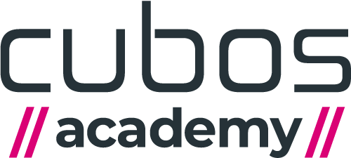

# Formação Full Stack - Cubos Academy

Este repositório contém o material e anotações do curso **Full Stack** disponibilizado gratuitamente pela [Cubos Academy](https://aulas.cubos.academy/). O objetivo deste curso é desenvolver habilidades em **front-end** e **back-end**, com foco em tecnologias e metodologias atuais exigidas pelo mercado de trabalho.

## Conteúdo do Curso

### Front-End
- **Design System**: Estruturação de componentes reutilizáveis para consistência em projetos.
- **TSDX**: Ferramenta para criação de bibliotecas TypeScript.
- **Figma**: Ferramenta para design de interfaces e prototipagem.
- **Component Chip**: Implementação de componentes visuais interativos.

### Back-End
- **Node.js com TypeScript**: Desenvolvimento prático de APIs e aplicações.
- **Clean Architecture**: Estruturação e design de sistemas de software com foco em escalabilidade e manutenção.
- **Test Driven Development (TDD)**: Desenvolvimento guiado por testes para maior confiabilidade do código.
- **Domain Driven Design (DDD)**: Foco na modelagem do domínio da aplicação.
- **Modularização de Projetos**: Organização eficiente do código para facilitar o aprendizado e a escalabilidade.

### Outros Tópicos
- **Lógica de Programação**: Fundamentos para construção de algoritmos eficientes.
- **HTML e CSS**: Criação de layouts web responsivos e acessíveis.
- **React**: Construção de interfaces dinâmicas com componentes reutilizáveis.

## Links Complementares
- [React Documentation](https://pt-br.react.dev/learn)
- [OpenAI API Quickstart (Node)](https://platform.openai.com/docs/quickstart?context=node)
- [Código Aula Mini Curso HTML & CSS - Cubos Academy](https://github.com/cubos-academy/codigo-aula-mini-curso-programacao-teachme-html-css)
- [HTML Element Reference - MDN](https://developer.mozilla.org/pt-BR/docs/Web/HTML/Element)
- [JavaScript Guide - MDN](https://developer.mozilla.org/pt-BR/docs/Web/JavaScript/Guide/Introduction)
- [JavaScript Basics - MDN](https://developer.mozilla.org/pt-BR/docs/Learn/Getting_started_with_the_web/JavaScript_basics)
- [CSS Documentation - MDN](https://developer.mozilla.org/pt-BR/docs/Web/CSS)
- [Código Aula Mini Curso React - Cubos Academy](https://github.com/cubos-academy/codigo-aula-mini-curso-programacao-teachme-react)

## Objetivo do Curso

O curso tem como objetivo fornecer uma base sólida tanto em desenvolvimento front-end quanto back-end, capacitando os estudantes a trabalhar com tecnologias atuais do mercado, além de desenvolver práticas que melhoram a qualidade do código e a produtividade no desenvolvimento de software.

