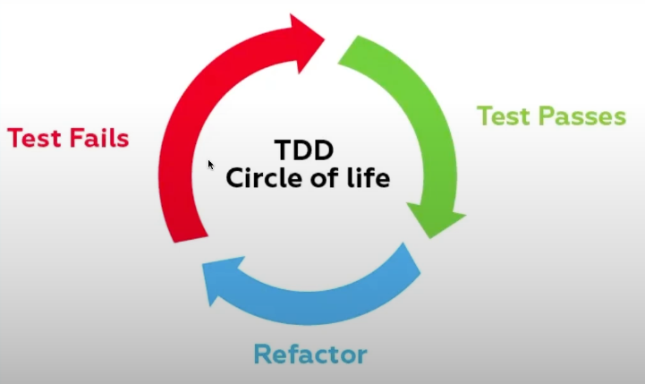
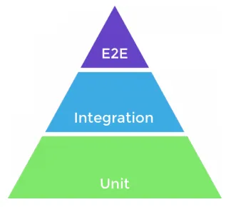

## TDD - Test Driven Development

**Test Driven Development (TDD)**, ou Desenvolvimento Orientado a Testes, é uma metodologia de desenvolvimento de software onde o processo começa escrevendo testes antes de implementar a funcionalidade. TDD ganhou popularidade por melhorar a **qualidade** do código, aumentar a **confiabilidade** do software e facilitar a **manutenção** e **escalabilidade**.

### Ciclo de Vida do TDD

O ciclo de TDD segue três passos fundamentais:

1. **Escrever um teste**: Antes de desenvolver a funcionalidade, você escreve um teste para definir o comportamento esperado.
2. **Ver o teste falhar**: Inicialmente, o teste falhará porque a funcionalidade ainda não foi implementada.
3. **Implementar a funcionalidade**: Agora, você escreve o código necessário para fazer o teste passar.
4. **Ver o teste passar**: Execute o teste novamente para verificar se o código implementado resolve o problema.
5. **Refatorar o código**: Após garantir que o teste passou, refatore o código para melhorar sua qualidade, mantendo o teste como uma verificação constante.

Este ciclo se repete continuamente, garantindo que cada funcionalidade seja testada e funcionará corretamente.

Lembre-se de que a ordem do fluxo é importante (testar, implementar, refatorar), mas o essencial é que os testes sejam criados para garantir a **confiabilidade** do que foi implementado.

### Principais Tipos de Testes

- **Coverage (Cobertura de Testes)**: Refere-se à porcentagem de código que é coberto pelos testes, garantindo que os casos mais importantes estão sendo testados.

1. **Testes Unitários**: 
   - Testam pequenas unidades do código (como funções ou métodos) de maneira isolada. São rápidos e fáceis de manter.
   
2. **Testes de Integração**: 
   - Verificam se diferentes partes do sistema (módulos ou serviços) funcionam bem quando combinadas.

3. **Testes End-to-End (E2E)**: 
   - Testam o sistema completo do ponto de vista do usuário, verificando se todos os componentes funcionam corretamente juntos.

### Pirâmide de Testes

A **Pirâmide de Testes** é uma analogia que ajuda a priorizar os tipos de testes de acordo com seu custo e benefício:

- Na **base** da pirâmide, temos os **testes unitários**, que são rápidos, fáceis de rodar e baratos em termos de processamento. Eles constituem a maior parte dos testes.
  
- No **meio** da pirâmide, estão os **testes de integração**, que garantem que os componentes funcionem juntos corretamente. Eles são um pouco mais lentos e complexos, então deve haver uma quantidade menor em relação aos testes unitários.

- No **topo** da pirâmide, temos os **testes end-to-end (E2E)**, que testam o sistema como um todo. São os mais lentos e caros de executar, então devem ser usados com moderação.

A pirâmide sugere que devemos ter **muitos testes unitários**, **alguns testes de integração** e **poucos testes end-to-end**.

