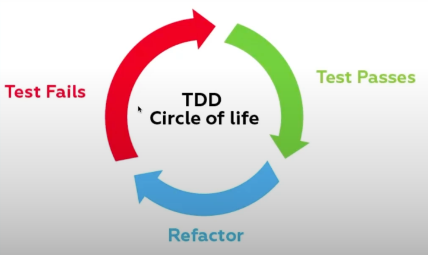

## TDD Test Driven Development
Test Driven Development (TDD), ou Desenvolvimento Orientado a Testes. O TDD é uma abordagem de desenvolvimento de software que está em alta devido à sua importância na estruturação e escalabilidade do código.

### Ciclo de Vida do TDD
O ciclo consiste em seguir um fluxo onde o teste é escrito primeiro, falha, implementa a funcionalidade, o teste passa, melhora ou refatora a funcionalidade, sempre repetindo esse fluxo. Lembramd que a ordem do fluxo é importante, mas não obrigatória, desde que os testes sejam criados garantido a confiabilidade do que foi implementado.

### Pesquise por 
- Coverage - Cobertura de TESTE

### Principais Tipos de TESTES
- Testes unitários
- Teste de Integração
- Teste end to end

### Pirâmide de TESTES

Cada tipo de teste tem seu custo se tratando de processamento, portanto, quanto menos custoso, mais são explorados. O processamento de um teste unitário deve ser mais rápido do que um teste de integração, que por sua vez, deve ser mais rápido que o teste end to end, nessa ordem.

A pirâmide de testes é como uma pirâmide alimentar, onde a base é a parte mais importante. Ela nos diz que devemos ter muitos testes unitários (como blocos de construção individuais), alguns testes de integração (verificar se todas as partes se encaixam) e apesnas alguns testes end to end (verificar se tudo funciona).

---